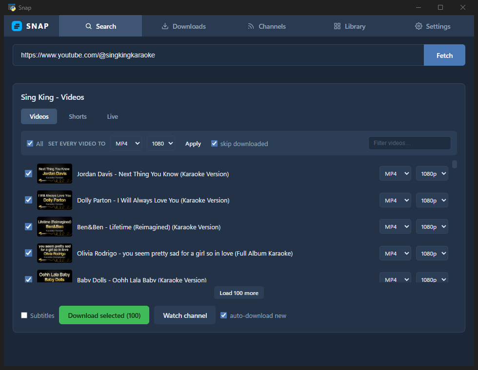

<div align="center">


**Grab video · rip audio · sync channels & playlists · build a library**

A fast, no-nonsense desktop downloader for Windows — a native GUI over
[yt-dlp](https://github.com/yt-dlp/yt-dlp) and ffmpeg.




</div>

---

## Features

### 🎬 Download anything
- **7 formats** — MP4, MKV (for 4K+ VP9/AV1), MP3, M4A, FLAC, WAV, OPUS
- **No wasted re-encodes** — M4A and OPUS keep YouTube's original stream bit-for-bit
- **Proper music files** — embedded cover art plus real artist / album / year tags looked up on MusicBrainz
- **Clip / trim** — grab just `0:30 – 1:45` of a video, keyframe-exact, in any format
- **Convert local files** — drop any media file on the window and re-format it with the bundled ffmpeg
- **Subtitles** — optional, with a language picker

### 🔍 Find it fast
- **Paste anything** — video, playlist, or channel links; copied links auto-fetch from the clipboard, dropped links too
- **Or just search** — type words instead of a URL and pick from the top YouTube results
- **Send to Snap** — a one-click browser bookmarklet (in Settings) opens the page you're on straight in Snap
- **Channel browsing** — Videos / Shorts / Live tabs, 100 at a time or everything at once with a progress bar
- **Playlist picker** — per-video format & quality, bulk apply, filter box, select/deselect all

### 📥 A queue that behaves
- Parallel downloads (configurable 1–5) with live progress, speed, and ETA
- Pause / resume the whole queue; cancel, retry, or copy the link of any job
- **Download memory** — Snap remembers everything you've ever grabbed, badges it on fetch, and can skip it in bulk selections (survives clearing the history)
- **Folder organization** — playlist and channel grabs sort into subfolders named after the source

### 📡 Channel watch & playlist sync
- Follow channels and get new **Videos / Shorts / Live** automatically — checked every 5–60 minutes, with optional auto-download
- **Sync playlists** — anything added to a followed playlist downloads into its folder by itself
- Channel avatars, per-watch format/quality, editable any time

### 🎧 Library
- Everything you've downloaded in one searchable grid — cover art from the files themselves, frame thumbnails for video
- Click to **play right in the app** (audio player bar, video overlay); right-click to reveal in Explorer

### 🖥️ Lives quietly in the tray
- Close (or minimize, if you like) hides to the tray — watches and downloads keep running
- Toast notifications when the queue finishes or a watched channel posts
- Optional **start with Windows**, straight to the tray
- Single instance — relaunching just brings the window back

### 🔄 Never goes stale
- **Updates yt-dlp in-app** — no pip, works in the packaged exe; one click when YouTube breaks things
- Checks GitHub for new Snap releases — and every tagged version is built automatically by CI

## Run from source

```powershell
pip install pywebview yt-dlp yt-dlp-ejs mutagen pystray pillow
winget install Gyan.FFmpeg
python app.py
```

> YouTube extraction needs a JavaScript runtime (Node or Deno) installed.

## Build a portable exe

```powershell
pip install pyinstaller
python -m PyInstaller Snap.spec --noconfirm
```

The build lands in `dist/Snap/` with ffmpeg bundled — zip it and take it anywhere.

## Good to know

- Downloads go to `~/Downloads/Snap` by default — change it in **Settings**
- History, watches, and settings persist in `%APPDATA%/Snap/state.json`
- Age-restricted / members-only videos: turn on **Settings → YouTube login** (uses your Edge sign-in)

## Credits

Built on the shoulders of [yt-dlp](https://github.com/yt-dlp/yt-dlp),
[pywebview](https://pywebview.flowrl.com/), and [FFmpeg](https://ffmpeg.org/).
